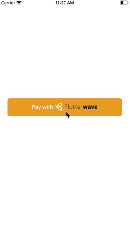
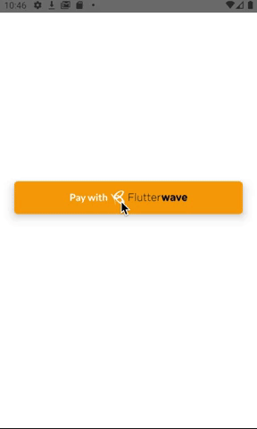

# React Native Flutterwave
Easily implement Flutterwave for payments in your React Native appliction. This library supports both Android and iOS, and use the Flutterwave's V2 API.

[](https://developer.flutterwave.com/v2.0/docs/getting-started) [](http://commitizen.github.io/cz-cli/)

<p align="center">
  
  
</p>

## Table Of Content
- Getting Started
  - [V3 API](#warning-if-using-version-3-api-warning)
  - [Installation](#installation)
  - [Dependencies](#dependencies)
  - [Activity Indicator (Android)](#activity-indicator-only-needed-for-android)
  - [Important Information](#fire-important-information-fire)
- Usage
  - [PayWithFlutterwaveV2 ](#paywithflutterwavev2)
  - [PayWithFlutterwaveV2 (with custom render)](#paywithflutterwavev2-with-custom-render)
  - [FlutterwaveButton (Flutterwave styled button)](#flutterwavebutton-flutterwave-styled-button)
  - [FlutterwaveInitV2](#flutterwaveinitv2)
  - [Aborting Payment Initialization](#aborting-payment-initialization)
- Props
  - [FlutterwaveInitV2Options](#flutterwaveinitv2options)
  - [PayWithFlutterwaveV2Props](#paywithflutterwavev2props)
  - [FlutterwaveButton Props](#flutterwavebutton-props)
- Types
  - [PayWithFlutterwaveV2Props](#paywithflutterwavev2props-interface)
  - [FlutterwaveButtonProps](#flutterwavebuttonprops-interface)
  - [FlutterwaveInitV2Options](#flutterwaveinitv2options-interface)
  - [FlutterwaveInitError](#flutterwaveiniterror)
  - [FlutterwavePaymentMetaV2](#flutterwavepaymentmetav2)
  - [RedirectParamsV2](#redirectparamsv2)
  - [CustomButtonProps](#custombuttonprops)
- [Contributing](./CONTRIBUTING.md)

## What's Inside?
- Pay with Flutterwave button and checkout dialog.
- Standard payment initialization function.
- Flutterwave designed button.

## :warning: If Using Version 3 API :warning:
This version of the library's docs focuses on use cases with the Version 2 of Flutterwaves API, if you are using the Version 3 API please use [this documentation](./README.md) instead.

## Installation
This library is available on npm, you can install it by running `npm install --save flutterwave-react-native` or `yarn add flutterwave-react-native`

### Dependencies
In order to render the Flutterwave checkout screen this library depends on [react-native-webview](https://github.com/react-native-community/react-native-webview) ensure you properly install this library before continuing.

### Activity Indicator (only needed for android)
To display the Flutterwave styled activity indicator when the checkout screen is being loaded on Android you will need to add some modules in `android/app/build.gradle`.
***Skip this if you already have setup your app to support gif images.***
````javascript
dependencies {
  // If your app supports Android versions before Ice Cream Sandwich (API level 14)
  implementation 'com.facebook.fresco:animated-base-support:1.3.0'

  // For animated GIF support
  implementation 'com.facebook.fresco:animated-gif:2.0.0'
}
````

### :fire: IMPORTANT INFORMATION :fire:
If the `options` property on the [PayWithFlutterwaveV2](flutterwavebuttonprops-interface) changes, when next the user taps on the button a new payment will be initialized whether the last one was successful or not.

Remember you cannot use the same transaction reference for two different payments, remember to recreate the transaction reference before allowing the user initiate a new payment.


## Usage
Below are a few examples showcasing how you can use the library to implement payment in your React Native app.

### PayWithFlutterwaveV2 


[View All Props](#flutterwavebuttonprops)

Import `PayWithFlutterwaveV2` from `flutterwave-react-native` and use it like so.
````jsx
import {PayWithFlutterwaveV2} from 'flutterwave-react-native';
// or import PayWithFlutterwaveV2 from 'flutterwave-react-native/PayWithFlutterwaveV2';

<PayWithFlutterwaveV2
  ...
  onRedirect={handleOnRedirect}
  options={{
    txref: txref,
    PBFPubKey: '[Your Flutterwave Public Key]',
    customer_email: 'customer-email@example.com',
    amount: 2000,
    currency: 'NGN',
  }}
/>
````

### PayWithFlutterwaveV2 (with custom render)


[View All Props](#flutterwavebuttonprops)

Import `PayWithFlutterwaveV2` from `flutterwave-react-native` and use it like so.
````jsx
import {PayWithFlutterwaveV2} from 'flutterwave-react-native';
// or import PayWithFlutterwaveV2 from 'flutterwave-react-native/PayWithFlutterwaveV2';

<PayWithFlutterwaveV2
  ...
  onRedirect={handleOnRedirect}
  options={{...}}
  customButton={(props) => (
    <TouchableOpacity
      style={styles.paymentButton}
      onPress={props.onPress}
      isBusy={props.isInitializing}
      disabled={props.disabled}>
        <Text style={styles.paymentButtonText}>Pay $500</Text>
    </TouchableOpacity>
  )}
/>
````

### FlutterwaveButton (Flutterwave styled button)


[View All Props](#flutterwavebuttonprops)

Import `FlutterwaveButton` from `flutterwave-react-native` and use it like so.
````jsx
import {FlutterwaveButton} from 'flutterwave-react-native';

<FlutterwaveButton
  style={styles.paymentButton}
  onPress={onPress}
  disabled={disabled}>
    <Text style={styles.paymentButtonText}>Pay $500</Text>
</FlutterwaveButton>
````

### FlutterwaveInitV2
When called, this function returns a Promise which resolves to a string on success and rejects if an error occurs. [See all config options](#flutterwaveinitv2options)

Import `FlutterwaveInitV2` from `flutterwave-react-native` and use it like so.
````javascript
import {FlutterwaveInitV2} from 'flutterwave-react-native';;
// or import FlutterwaveInitV2 from 'flutterwave-react-native/FlutterwaveInitV2';

// initialize a new payment
const payment = await FlutterwaveInitV2({
  txref: generateTransactionRef(),
  PBFPubKey: '[Your Flutterwave Public Key]',
  amount: 100,
  currency: 'USD',
});

// link is available if payment initialized successfully
if (payment.link) {
  // use payment link
  return usePaymentLink(payment.link);
}

// handle payment error
handlePaymentError(
  payment.error
    ? paymet.error.message
    : 'Kai, an unknown error occurred!'
);
````
### Aborting Payment Initialization
Hi :wave:, so there are cases where you have already initialized a payment with `FlutterwaveInitV2` but might also want to be able to cancel the payment initialization should in case your component is being unmounted or you want to allow users cancel the action before the payment is initialized, we have provided a way for you to do this... [continue reading](./docs/v2/AbortingPaymentInitialization.md)

## Props

### FlutterwaveInitV2Options
[See Interface](#flutterwaveinitv2options-interface)
| Name     | Required | Type | Default | Description |
| --------- | --------- | ---- | ------- | ----------- |
| PBFPubKey | Yes | string | **REQUIRED** | Your merchant public key, see how to get your [API Keys](https://developer.flutterwave.com/v2.0/docs/api-keys)|
| txref | Yes | string | **REQUIRED** | Your Unique transaction reference.|
| customer_email | Yes | string | **REQUIRED** | The customer's email address. |
| customer_phone | No | string | undefined | The customer's phone number. |
| customer_firstname | No | string | undefined | The customer's first name. |
| customer_lastname | No | string | undefined | The customer's last name. |
| amount | Yes | number | undefined | Amount to charge the customer.|
| currency | No | string | NGN | Currency to charge in. Defaults to NGN. Check our [International Payments](https://developer.flutterwave.com/v2.0/docs/multicurrency-payments) section for more on international currencies.|
| redirect_url | No | string | undefined | URL to redirect to when a transaction is completed. This is useful for 3DSecure payments so we can redirect your customer back to a custom page you want to show them. |
| payment_options | No | string | undefined | This allows you to select the payment option you want for your users, see [Choose Payment Methods](https://developer.flutterwave.com/v2.0/docs/splitting-payment-methods) for more info. |
| payment_plan | No | number | undefined | This is the payment plan ID used for [Recurring billing](https://developer.flutterwave.com/v2.0/docs/recurring-billing). |
| subaccounts | No | array of [FlutterwaveInitSubAccount](#flutterwaveinitsubaccount) | undefined | This is an array of objects containing the subaccount IDs to [split the payment](https://developer.flutterwave.com/v2.0/docs/split-payment) into. |
| country | No | string | NG | Route country. Defaults to NG |
| pay_button_text | No | string | undefined | Text to be displayed on the Rave Checkout Button. |
| custom_title | No | string | undefined | Text to be displayed as the title of the payment modal. |
| custom_description | No | string | undefined | Text to be displayed as a short modal description. |
| custom_logo | No | string | undefined | Link to the Logo image. |
| meta | No | array of [FlutterwavePaymentMetaV2](#flutterwavepaymentmetav2) | undefined | Any other custom data you wish to pass. |

### PayWithFlutterwaveV2Props
[See Interface](#paywithflutterwavev2props-interface)
| Name     | Required | Type | Default | Description |
| --------- | --------- | ---- | ------- | ----------- |
| style | No | object | undefined | Used to apply styling to the button.|
| onRedirect | Yes | function | **REQUIRED** | Called when a payment is completed successfully or is canceled. The function will receive [on complete data](#oncompletedata)|
| onWillInitialize | No | function | undefined | This will be called before a payment link is generated.|
| onDidInitialize | No | function | undefined | This is called when a new payment link has been successfully initialized.|
| onInitializeError | No | function | undefined | This is called if an error occurred while initializing a new pyment link. The function will receive [FlutterwaveInitError](#flutterwaveiniterror) |
| onAbort | No | function | undefined | This is called if a user aborts a transaction, a user can abort a transaction when they click on the dialog's backdrop and choose cancel when prompted to cancel transaction. |
| options | Yes | **[FlutterwaveInitOptions](#flutterwaveinitv2options)** | **REQUIRED** | The option passed here is used to initialize a payment. |
| customButton | No | function | undefined | This is used to render a custom button. The function a prop argument structured like [CustomButtonProps](#custombuttonprops), this function should return a valid React node. |
| alignLeft | No | boolean | undefined | This aligns the content of the button to the left. |

### FlutterwaveButton Props
[See Interface](#flutterwavebuttonprops-interface)
| Name     | Required | Type | Default | Description |
| --------- | --------- | ---- | ------- | ----------- |
| style | No | ViewStyle | undefined | This component uses the same style properties that are applicable to react-native's View component style.|
| onPress | Yes | function | undefined | This property receive a function that is called on button press. |
| disabled | No | boolean | undefined | This disables button, and causes onPress not to be fired.|
| alignLeft | No | boolean | undefined | This aligns the content of the button to the left. |

## Types
#### CustomButtonProps
````typescript
interface CustomButtonProps {
  disabled: boolean;
  isInitializing: boolean;
  onPress: () => void;
}
````

#### RedirectParamsV2
````typescript
interface RedirectParamsV2 {
  canceled?: 'true' | 'false';
  flwref?: string;
  txref: string;
}
````

#### FlutterwaveInitError
````typescript
interface FlutterwaveInitError {
  code: string;
  message: string;
}
````

### FlutterwaveInitSubAccount
```typescript
interface FlutterwaveInitSubAccount {
  id: string;
  transaction_split_ratio?: number;
  transaction_charge_type?: string;
  transaction_charge?: number;
}
```

#### FlutterwavePaymentMetaV2
````typescript
interface FlutterwavePaymentMetaV2 {
  metaname: string;
  metavalue: string;
}
````

#### FlutterwaveInitV2Options Interface
````typescript
export interface FlutterwaveInitV2Options {
  txref: string;
  PBFPubKey: string;
  customer_firstname?: string;
  customer_lastname?: string;
  customer_phone?: string;
  customer_email: string;
  amount: number;
  currency?: string;
  redirect_url?: string;
  payment_options?: string;
  payment_plan?: number;
  subaccounts?: Array<FlutterwaveInitSubAccount>;
  country?: string;
  pay_button_text?: string;
  custom_title?: string;
  custom_description?: string;
  custom_logo?: string;
  meta?: Array<FlutterwavePaymentMetaV2>;
}
````

#### PayWithFlutterwaveV2Props Interface
````typescript
interface PayWithFlutterwaveV2Props {
  style?: ViewStyle;
  onRedirect: (data: RedirectParamsV2) => void;
  onWillInitialize?: () => void;
  onDidInitialize?: () => void;
  onInitializeError?: (error: FlutterwaveInitError) => void;
  onAbort?: () => void;
  options: Omit<FlutterwaveInitOptions, 'redirect_url'>;
  customButton?: (props: CustomButtonProps) => React.ReactNode;
  alignLeft?: 'alignLeft' | boolean;
}
````

#### FlutterwaveButtonProps Interface
````typescript
interface FlutterwaveButton {
  style?: ViewStyle;
  onPress?: () => void;
  disabled?: boolean;
  alignLeft?: 'alignLeft' | boolean,
}
````

## Contributing
For information on how you can contribute to this repo, simply [go here](./CONTRIBUTING.md), all contributions are greatly appreciated.

With love from Flutterwave. :yellow_heart:
