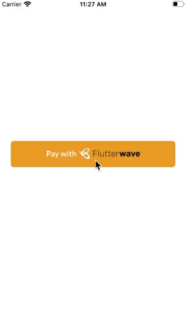
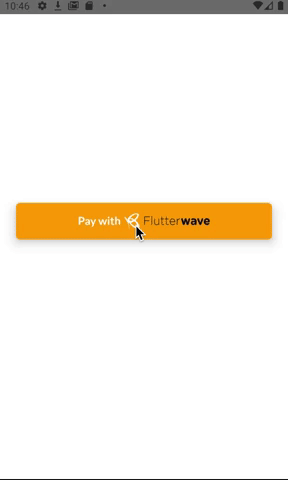

# React Native Flutterwave
Easily integrate Flutterwave for payment collection in your React Native application. This library is compatible with both Android and iOS and utilizes Flutterwave's V2 API.

[](https://developer.flutterwave.com/v2.0/docs/getting-started) [](http://commitizen.github.io/cz-cli/)

<p align="center">
  
  
</p>

## Table Of Content
- Getting Started
  - [V3 API](#warning-if-using-version-3-api-warning)
  - [Installation](#installation)
  - [Dependencies](#dependencies)
  - [Activity Indicator (Android)](#activity-indicator-only-needed-for-android)
  - [Important Information](#fire-important-information-fire)
- Usage
  - [PayWithFlutterwaveV2 ](#paywithflutterwavev2)
  - [PayWithFlutterwaveV2 (with custom render)](#paywithflutterwavev2-with-custom-render)
  - [FlutterwaveButton (Flutterwave styled button)](#flutterwavebutton-flutterwave-styled-button)
  - [FlutterwaveInitV2](#flutterwaveinitv2)
  - [Aborting Payment Initialization](#aborting-payment-initialization)
- Props
  - [FlutterwaveInitV2Options](#flutterwaveinitv2options)
  - [PayWithFlutterwaveV2Props](#paywithflutterwavev2props)
  - [FlutterwaveButton Props](#flutterwavebutton-props)
- Types
  - [PayWithFlutterwaveV2Props](#paywithflutterwavev2props-interface)
  - [FlutterwaveButtonProps](#flutterwavebuttonprops-interface)
  - [FlutterwaveInitV2Options](#flutterwaveinitv2options-interface)
  - [FlutterwaveInitError](#flutterwaveiniterror)
  - [FlutterwavePaymentMetaV2](#flutterwavepaymentmetav2)
  - [RedirectParamsV2](#redirectparamsv2)
  - [CustomButtonProps](#custombuttonprops)
- [Contributing](./CONTRIBUTING.md)

## What's Inside?
- Pay with Flutterwave button and checkout dialog.
- Standard payment initialization function.
- Flutterwave designed button.

## :warning: If Using Version 3 API :warning:
This section of the documentation focuses on use cases for Version 2 of the Flutterwave API. If you are using Version 3 of the API, please refer to [this documentation](./README.md) instead.

## Installation
This library is available on npm. You can install it by running the following command:

`npm install --save flutterwave-react-native` 

or

`yarn add flutterwave-react-native`

### Dependencies
To render the Flutterwave checkout screen, this library requires the installation of [react-native-webview](https://github.com/react-native-community/react-native-webview). Please ensure that this library is installed correctly before proceeding.

### Activity Indicator (only needed for android)
To display the Flutterwave styled activity indicator when the checkout screen is loading on Android, you will need to add a few modules to your `android/app/build.gradle` file.
**_Skip this step if your app is already setup to support gif images._**

````javascript
dependencies {
  // Include this if your app supports Android versions before Ice Cream Sandwich (API level 14)
  implementation 'com.facebook.fresco:animated-base-support:1.3.0'

  // Add this for animated GIF support
  implementation 'com.facebook.fresco:animated-gif:2.0.0'
}
````

### :fire: IMPORTANT INFORMATION :fire:
If the `options` property on [PayWithFlutterwaveV2](#paywithflutterwaveprops-interface) changes, the next time your customer taps on the button a new payment will be initialized regardless of whether the previous transaction was successful or not.

Keep in mind that you cannot use the same transaction reference for two different payments. Make sure you generate a new transaction reference before allowing your customer start a new payment.


## Usage

Below are some examples demonstrating how to implement payment features in your React Native application.

### PayWithFlutterwaveV2 


[View All Props](#flutterwavebuttonprops)

Import `PayWithFlutterwaveV2` from `flutterwave-react-native` and use it like so.
````jsx
import {PayWithFlutterwaveV2} from 'flutterwave-react-native';
// or import PayWithFlutterwaveV2 from 'flutterwave-react-native/PayWithFlutterwaveV2';

<PayWithFlutterwaveV2
  ...
  onRedirect={handleOnRedirect}
  options={{
    txref: txref,
    PBFPubKey: '[Your Flutterwave Public Key]',
    customer_email: 'customer-email@example.com',
    amount: 2000,
    currency: 'NGN',
  }}
/>
````

### PayWithFlutterwaveV2 (with custom render)


[View All Props](#flutterwavebuttonprops)

Import `PayWithFlutterwaveV2` from `flutterwave-react-native` and use it like so.
````jsx
import {PayWithFlutterwaveV2} from 'flutterwave-react-native';
// or import PayWithFlutterwaveV2 from 'flutterwave-react-native/PayWithFlutterwaveV2';

<PayWithFlutterwaveV2
  ...
  onRedirect={handleOnRedirect}
  options={{...}}
  customButton={(props) => (
    <TouchableOpacity
      style={styles.paymentButton}
      onPress={props.onPress}
      isBusy={props.isInitializing}
      disabled={props.disabled}>
        <Text style={styles.paymentButtonText}>Pay $500</Text>
    </TouchableOpacity>
  )}
/>
````

### FlutterwaveButton (Flutterwave styled button)


[View All Props](#flutterwavebuttonprops)

Import `FlutterwaveButton` from `flutterwave-react-native` and use it like so.
````jsx
import {FlutterwaveButton} from 'flutterwave-react-native';

<FlutterwaveButton
  style={styles.paymentButton}
  onPress={onPress}
  disabled={disabled}>
    <Text style={styles.paymentButtonText}>Pay $500</Text>
</FlutterwaveButton>
````

### FlutterwaveInitV2

When called, this function returns a Promise that either resolves to a string on success or rejects if an error occurs. [See all config options](#flutterwaveinitv2options).

Import `FlutterwaveInitV2` from `flutterwave-react-native` and use it like so.
````javascript
import {FlutterwaveInitV2} from 'flutterwave-react-native';;
// or import FlutterwaveInitV2 from 'flutterwave-react-native/FlutterwaveInitV2';

// initialize a new payment
const payment = await FlutterwaveInitV2({
  txref: generateTransactionRef(),
  PBFPubKey: '[Your Flutterwave Public Key]',
  amount: 100,
  currency: 'USD',
});

// link is available if payment initialized successfully
if (payment.link) {
  // use payment link
  return usePaymentLink(payment.link);
}

// handle payment error
handlePaymentError(
  payment.error
    ? paymet.error.message
    : 'Kai, an unknown error occurred!'
);
````
### Aborting Payment Initialization
:wave: Hi! There may be cases where you've already initiated a payment using `FlutterwaveInitV2` but you might want the option of canceling the payment initiation. This could be necessary if your component is being unmounted or if you want to allow customers to cancel the action before the payment process begins. We have provided a method for you to accomplish this. [continue reading](./docs/v2/AbortingPaymentInitialization.md).

## Props

### FlutterwaveInitV2Options
[See Interface](#flutterwaveinitv2options-interface)
| Name     | Required | Type | Default | Description |
| --------- | --------- | ---- | ------- | ----------- |
| PBFPubKey | Yes | string | **REQUIRED** | Your merchant public key. Learn how to retrieve your keys [here](https://flutterwave.com/gh/support/my-account/getting-your-api-keys).|
| txref | Yes | string | **REQUIRED** | Your Unique transaction reference.|
| customer_email | Yes | string | **REQUIRED** | The customer's email address. |
| customer_phone | No | string | undefined | The customer's phone number. |
| customer_firstname | No | string | undefined | The customer's first name. |
| customer_lastname | No | string | undefined | The customer's last name. |
| amount | Yes | number | undefined | The amount to charge the customer.|
| currency | No | string | NGN | The currency to charge in. Defaults to NGN. Check our [International Payments](https://flutterwave.com/tz/support/general/what-are-the-currencies-accepted-on-flutterwave) section for more on international currencies.|
| redirect_url | No | string | undefined | The URL where you want to redirect customers after a completed transaction. This is useful for 3DSecure payments, allowing us to send your customer to a custom page you wish to display.  |
| payment_options | No | string | undefined | This specifies the payment options displayed to your customers see [Choose Payment Methods](https://flutterwave.com/zm/support/payment-methods) for more info. |
| payment_plan | No | number | undefined | This is the payment plan ID used for recurring payments. You can learn more by visiting [here](https://flutterwave.com/tz/support/payments/how-recurring-payments-work). |
| subaccounts | No | array of [FlutterwaveInitSubAccount](#flutterwaveinitsubaccount) | undefined |  This is an array of objects containing the subaccount IDs for splitting payments. Find more information, visit our [split payment page](https://flutterwave.com/us/support/payments/split-payments-with-sub-accounts). |
| country | No | string | NG | Route country. Defaults to NG |
| pay_button_text | No | string | undefined | Text to be displayed on the Checkout Button. |
| custom_title | No | string | undefined | Text to be displayed as the title of the payment modal. |
| custom_description | No | string | undefined | Text to be displayed as a short modal description. |
| custom_logo | No | string | undefined | Link to the Logo image. |
| meta | No | array of [FlutterwavePaymentMetaV2](#flutterwavepaymentmetav2) | undefined | This object is used to include additional payment information for your request.|

### PayWithFlutterwaveV2Props
[See Interface](#paywithflutterwavev2props-interface)
| Name     | Required | Type | Default | Description |
| --------- | --------- | ---- | ------- | ----------- |
| style | No | object | undefined | This property is used to apply styling to the button.|
| onRedirect | Yes | function | **REQUIRED** | This function is called when a payment is either completed successfully or canceled. It receives [on complete data](#oncompletedata).|
| onWillInitialize | No | function | undefined | This function is called before a payment link is generated.|
| onDidInitialize | No | function | undefined | This function is called when a new payment link has been successfully initialized.|
| onInitializeError | No | function | undefined | This function is called when an error occurs while initializing a new payment link, and it will receive a [FlutterwaveInitError](#flutterwaveiniterror). |
| onAbort | No | function | undefined | This function is called If a customer aborts a transaction, they can do so by clicking on the dialog's backdrop and selecting cancel when prompted. |
| options | Yes | **[FlutterwaveInitOptions](#flutterwaveinitv2options)** | **REQUIRED** | The option passed here is used to initialize a payment. |
| customButton | No | function | undefined | This function renders a custom button and takes a prop argument structured like [CustomButtonProps](#custombuttonprops). It should return a valid React node. |
| alignLeft | No | boolean | undefined | This property aligns the content of the button to the left. |

### FlutterwaveButton Props
[See Interface](#flutterwavebuttonprops-interface)
| Name     | Required | Type | Default | Description |
| --------- | --------- | ---- | ------- | ----------- |
| style | No | ViewStyle | undefined | This component accepts the same style properties applicable to React-Native View component.|
| onPress | Yes | function | undefined | This property receive a function that is called when the button is pressed. |
| disabled | No | boolean | undefined | This disables the button, preventing the onPress function from being triggered.|
| alignLeft | No | boolean | undefined | This aligns the content of the button to the left. |

## Types
#### CustomButtonProps
````typescript
interface CustomButtonProps {
  disabled: boolean;
  isInitializing: boolean;
  onPress: () => void;
}
````

#### RedirectParamsV2
````typescript
interface RedirectParamsV2 {
  canceled?: 'true' | 'false';
  flwref?: string;
  txref: string;
}
````

#### FlutterwaveInitError
````typescript
interface FlutterwaveInitError {
  code: string;
  message: string;
}
````

### FlutterwaveInitSubAccount
```typescript
interface FlutterwaveInitSubAccount {
  id: string;
  transaction_split_ratio?: number;
  transaction_charge_type?: string;
  transaction_charge?: number;
}
```

#### FlutterwavePaymentMetaV2
````typescript
interface FlutterwavePaymentMetaV2 {
  metaname: string;
  metavalue: string;
}
````

#### FlutterwaveInitV2Options Interface
````typescript
export interface FlutterwaveInitV2Options {
  txref: string;
  PBFPubKey: string;
  customer_firstname?: string;
  customer_lastname?: string;
  customer_phone?: string;
  customer_email: string;
  amount: number;
  currency?: string;
  redirect_url?: string;
  payment_options?: string;
  payment_plan?: number;
  subaccounts?: Array<FlutterwaveInitSubAccount>;
  country?: string;
  pay_button_text?: string;
  custom_title?: string;
  custom_description?: string;
  custom_logo?: string;
  meta?: Array<FlutterwavePaymentMetaV2>;
}
````

#### PayWithFlutterwaveV2Props Interface
````typescript
interface PayWithFlutterwaveV2Props {
  style?: ViewStyle;
  onRedirect: (data: RedirectParamsV2) => void;
  onWillInitialize?: () => void;
  onDidInitialize?: () => void;
  onInitializeError?: (error: FlutterwaveInitError) => void;
  onAbort?: () => void;
  options: Omit<FlutterwaveInitOptions, 'redirect_url'>;
  customButton?: (props: CustomButtonProps) => React.ReactNode;
  alignLeft?: 'alignLeft' | boolean;
}
````

#### FlutterwaveButtonProps Interface
````typescript
interface FlutterwaveButton {
  style?: ViewStyle;
  onPress?: () => void;
  disabled?: boolean;
  alignLeft?: 'alignLeft' | boolean,
}
````

## Contributing
For information on how you can contribute to this repo, simply [go here](./CONTRIBUTING.md), all contributions are greatly appreciated.

With love from Flutterwave. :yellow_heart:
